# Introduction and Use Case {#sec-intro}

## The Problem

Food insecurity—the lack of consistent access to enough food for an active, healthy life—affects **44.2 million Americans** (13.5% of households) as of 2023 [@alma9916546833607426]. These disparities reflect structural barriers including residential segregation, wage gaps, and differential access to quality employment [@myers2017food], with Black (22.4%) and Hispanic (20.8%) households experiencing rates more than double that of white non-Hispanic households (9.3%) [@rabbitt2023household].

## Target Users and Use Case

**Primary Users:**

-   **Policymakers:** Federal, state, and local officials designing food assistance programs
-   **Researchers:** Academic investigators studying food security determinants
-   **Nonprofit Organizations:** Food banks and advocacy groups allocating resources
-   **Public Health Officials:** Practitioners addressing nutrition-related health outcomes

**Key Questions This App Answers:**

1.  Which counties have the highest food insecurity rates and why?
2.  How do racial and socioeconomic disparities manifest geographically?
3.  What economic factors predict food insecurity at the county level?
4.  How have food insecurity patterns changed over 15 years (2009-2023)?
5.  Which counties share similar profiles for targeted interventions?

## App Workflow

The application guides users through three progressive stages:

1.  **Overview:** Understand definitions, national context, and key trends
2.  **Exploration:** Visualize geographic patterns, temporal trends, and distributions
3.  **Analysis:** Apply statistical methods to test hypotheses and identify predictors

This vignette walks through each stage using realistic scenarios to demonstrate the app's capabilities.

# Required Packages and Setup {#sec-packages}

The application requires the following R packages with minimum version specifications:

```{r}
#| eval: false
#| echo: true

# Core Shiny and Web Framework
packages <- c(
  "shiny",        # >= 1.8.0  - Web application framework
  "bslib",        # >= 0.6.0  - Bootstrap themes for modern UI
  
  # Data Manipulation and Visualization
  "tidyverse",    # >= 2.0.0  - Data wrangling (dplyr, ggplot2, tidyr)
  "leaflet",      # >= 2.2.0  - Interactive maps
  "plotly",       # >= 4.10.0 - Interactive plots
  "DT",           # >= 0.31   - Interactive tables
  
  # Statistical Analysis
  "nnet",         # >= 7.3-19 - Multinomial logistic regression
  "rpart",        # >= 4.1-23 - Decision trees and CART
  "broom"         # >= 1.0.5  - Model tidying and formatting
)

install.packages(packages)
```

**Development Environment:**

-   R version: 4.3.2 or higher
-   Compatible browsers: Chrome, Firefox, Safari, Edge (latest versions)
-   Recommended screen resolution: 1920×1080 or higher for optimal visualization

# Data Sources and Structure {#sec-data}

## Primary Data Sources

The app integrates two authoritative datasets covering all U.S. counties from 2009-2023.

### Feeding America Map the Meal Gap (2009-2023)

County-level food insecurity estimates published annually by Feeding America [@FeedingAmerica2025_MapTheMealGapData]. Key variables include:

-   Overall and child food insecurity rates
-   Food insecurity by race/ethnicity (Black, Hispanic, White non-Hispanic)
-   Cost per meal and annual food budget shortfall
-   Number of food insecure persons and children

**Data Access:** https://www.feedingamerica.org/research/map-the-meal-gap/by-county

### U.S. Census Bureau American Community Survey

ACS 5-Year Estimates provide socioeconomic indicators [@USCensusBureau2024_ACS5Year]:

-   Poverty rates and median household income
-   Unemployment and labor force participation
-   Educational attainment levels (% high school or less)
-   Household composition (% female-headed households)
-   Demographic characteristics (race/ethnicity percentages, age distribution)

**Data Access:** https://www.census.gov/data/developers/data-sets/acs-5year.html

## Data Structure

**Observations:** 47,265 county-year combinations\
**Geographic Coverage:** 3,156 counties across all 50 states + District of Columbia\
**Temporal Coverage:** 15 years (2009-2023)\
**Variables:** 52 processed variables

**Key Variable Categories:**

-   **Outcomes:** Food insecurity rates (overall, child, by race/ethnicity)
-   **Economic Predictors:** Poverty rate, median income, unemployment rate, SNAP participation
-   **Demographic Factors:** Racial composition, educational attainment, household structure
-   **Geographic Identifiers:** County FIPS codes, state, census region/division, urban/rural classification

**Data Processing Pipeline:**

1.  Harmonization of variable names across 15 years of data collection
2.  Standardization of county FIPS codes for spatial joins
3.  Creation of categorical variables for food insecurity severity levels
4.  Derivation of urban/rural classification from population density thresholds

```{r}
#| eval: false
#| echo: true

# Example: Final data structure
glimpse(food_data)
# Rows: 47,265
# Columns: 52
# $ fips                 <chr> "01001", "01003", "01005"...
# $ county               <chr> "Autauga County", "Baldwin County"...
# $ state                <chr> "AL", "AL", "AL"...
# $ year                 <dbl> 2023, 2023, 2023...
# $ overall_fi_rate      <dbl> 0.124, 0.108, 0.142...
# $ child_fi_rate        <dbl> 0.175, 0.149, 0.198...
# $ poverty_rate         <dbl> 0.112, 0.098, 0.154...
# $ median_income        <dbl> 63420, 68935, 49812...
# $ unemployment_rate    <dbl> 0.034, 0.029, 0.051...
# $ fi_category          <fct> Moderate, Low, Moderate...
```

# Exploratory Data Analysis Walkthrough {#sec-eda}

This section demonstrates the app's exploratory capabilities through guided scenarios. Each walkthrough follows the format: research question → variable selection → visualization → interpretation.

## Overview: Understanding the National Context

**Research Question:** What is the current state of food insecurity in the United States, and how does it vary across key demographic groups?

**Variables Selected:** National food insecurity rate, total food insecure persons, child food insecurity rate, cost per meal

**Navigation:** Overview tab

::: {#fig-overview layout-ncol="2"}
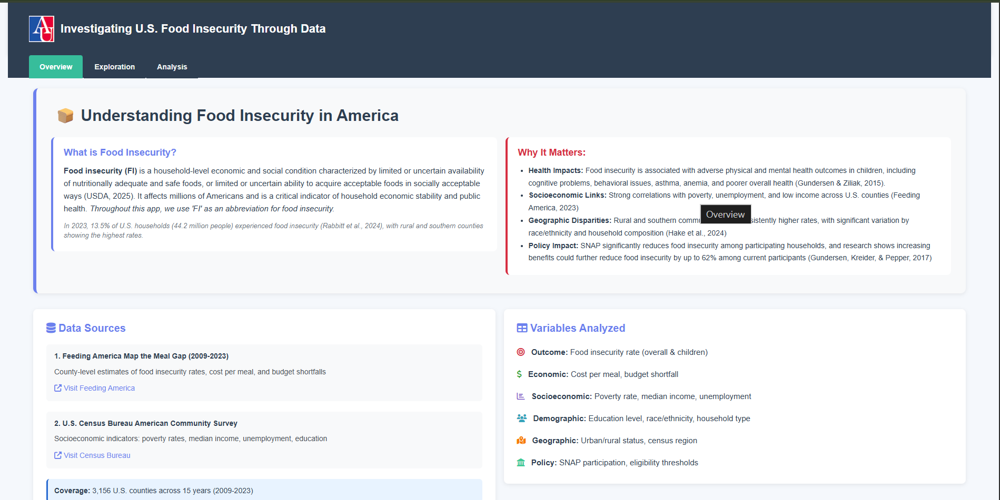{#fig-overview-intro}

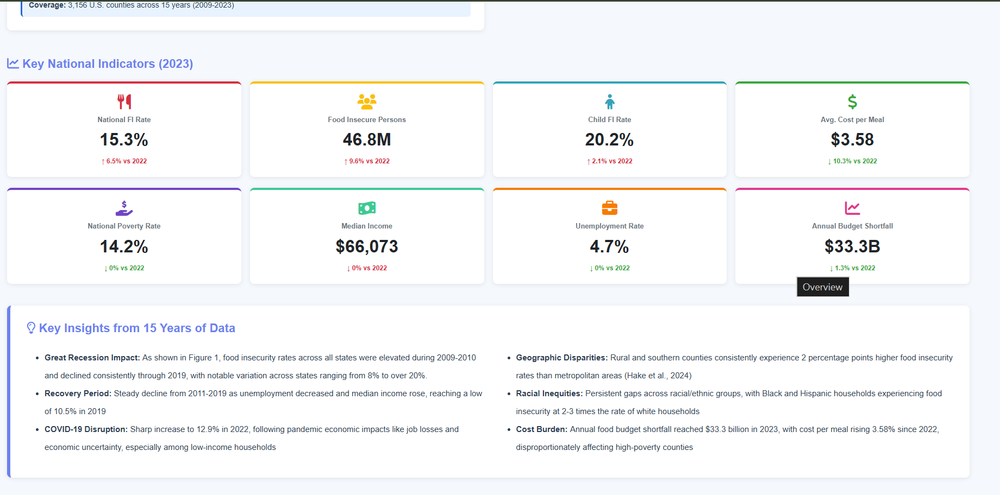{#fig-overview-kpi}

Overview tab showing food insecurity context and national metrics
:::

**Interpretation:** @fig-overview demonstrates the app's introductory interface, where users first encounter the USDA definition of food insecurity and understand the scale of the problem. @fig-overview-kpi presents 2023 national indicators showing 15.3% of Americans (46.8 million people) experienced food insecurity, with children experiencing higher rates (20.2%) and the national average cost per meal at \$3.58. These metrics establish the baseline context for subsequent geographic and demographic exploration, revealing that food insecurity remains a substantial national challenge affecting nearly one in six Americans.

## Geographic Patterns: Mapping County-Level Disparities

**Research Question:** Which counties have the highest food insecurity rates, and how do patterns vary geographically across the United States?

**Variables Selected:** Overall food insecurity rate (2023), county boundaries, state filters

**Navigation:** Exploration tab → Map sub-tab

{#fig-map width="100%"}

**Interpretation:** @fig-map reveals stark geographic disparities in food insecurity, with the highest rates (dark red, 20-30%) concentrated in the Mississippi Delta. These patterns align with structural economic disadvantages in these regions, including persistent poverty, limited employment opportunities, and historical underinvestment. Conversely, the lowest rates (light green, \<10%) cluster in metropolitan areas and affluent suburban counties, particularly in the Northeast and upper Midwest. The spatial concentration suggests that food insecurity is not randomly distributed but reflects underlying geographic inequalities in economic opportunity and infrastructure.

## Temporal Trends: How Has Food Insecurity Changed?

**Research Question:** How have food insecurity rates evolved over the past 15 years, and what economic events influenced these trends?

**Variables Selected:** Overall food insecurity rate (2009-2023), year, optional state filter

**Navigation:** Exploration tab → Trends sub-tab → State Trends

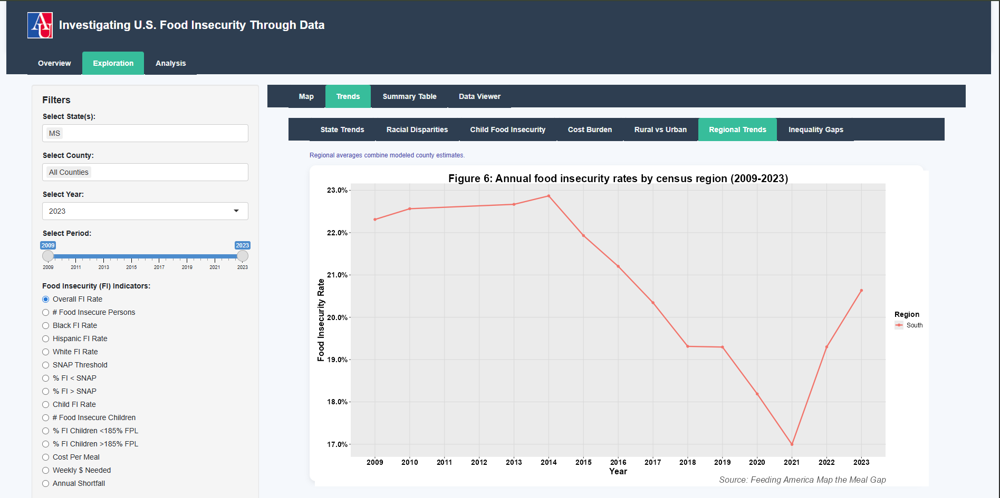{#fig-timeline width="100%"}

**Interpretation:** @fig-timeline demonstrates three distinct periods in food insecurity trends over 15 years. First, elevated rates during the Great Recession (2009-2011) peaked around 15-16%, reflecting massive job losses and economic contraction. Second, a steady decline from 2011-2019 coincided with economic recovery and employment growth, reaching a low near 11%. Third, and most revealing, food insecurity remained relatively stable during the initial COVID-19 pandemic (2020) due to emergency assistance programs, actually improved in 2021, then surged in 2022-2023 as inflation spiked and pandemic-era benefits terminated. This pattern underscores that economic policy interventions can effectively buffer food insecurity, but their withdrawal during periods of high food costs creates renewed vulnerability.

## Racial Disparities: Examining Inequities Across Groups

**Research Question:** How do food insecurity rates differ across racial and ethnic groups, and have these disparities changed over time?

**Variables Selected:** Food insecurity rates by race/ethnicity (Black, Hispanic, White non-Hispanic), year (2009-2023)

**Navigation:** Exploration tab → Trends sub-tab → Racial Disparities

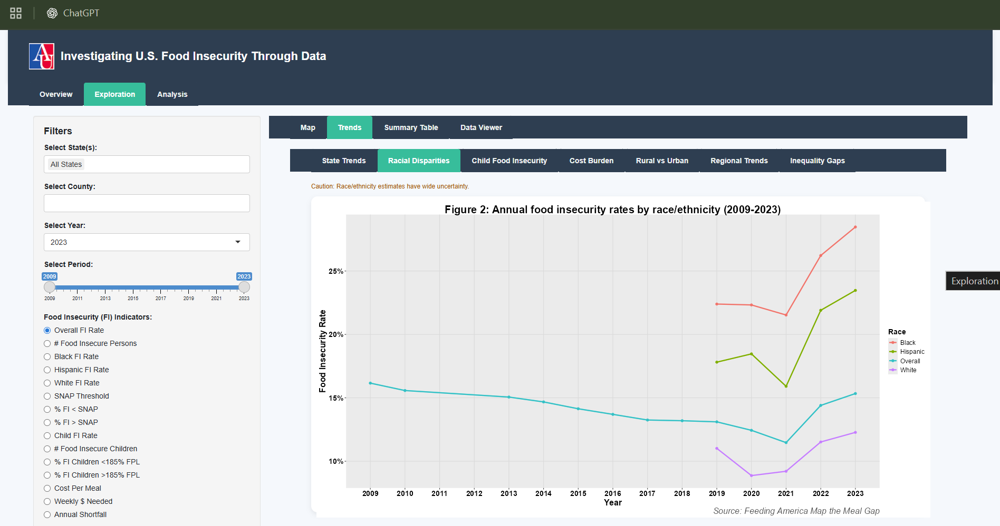{#fig-racial-trends width="100%"}

**Interpretation:** @fig-racial-trends reveals persistent and substantial racial disparities in food insecurity that have remained remarkably stable over 15 years. Black individuals consistently experience rates of 22-25%, Hispanic individuals 18-22%, and white non-Hispanic individuals 8-12%, maintaining an approximate 2-3x disparity throughout economic cycles. Critically, these gaps did not narrow during periods of economic growth (2011-2019) nor widen disproportionately during recessions, indicating structural factors—such as wage gaps, occupational segregation, and differential access to wealth—that transcend economic conditions. The persistence of these disparities across varying economic contexts underscores that food insecurity among communities of color reflects systemic inequities rather than temporary economic fluctuations.

**Additional Exploration Features:**

Users can further explore patterns using additional sub-tabs not shown here:

-   **Summary Table tab:** Provides grouped statistics by state/county to compare aggregate patterns
-   **Data Viewer tab:** Allows custom filtering by year, state, or threshold values to identify specific counties of interest for detailed investigation

These tools enable flexible exploration tailored to specific research questions or policy contexts.

# Statistical Analysis Walkthrough {#sec-analysis}

This section demonstrates the app's statistical analysis capabilities, progressing from correlation analysis to advanced modeling techniques.

## Correlation Analysis: Identifying Key Predictors

**Research Question:** Which socioeconomic and demographic variables show the strongest bivariate relationships with food insecurity?

**Variables Selected:** Overall food insecurity rate, poverty rate, median income, unemployment rate, educational attainment (% HS or less), household structure (% female-headed), racial composition (% Black, % Hispanic)

**Navigation:** Analysis tab → Correlation method

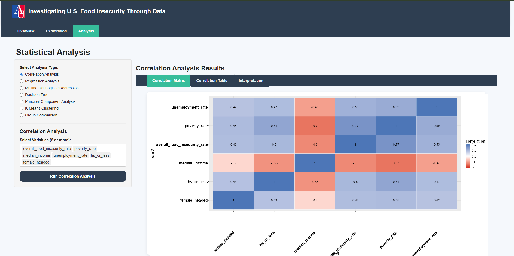{#fig-correlation width="100%"}

**Interpretation:** @fig-correlation reveals poverty rate as the single strongest correlate of food insecurity (r ≈ 0.77), demonstrating that direct economic deprivation is the primary driver of food access limitations. Median income shows a strong negative correlation (r ≈ -0.60), confirming that higher household resources reduce food insecurity risk. Unemployment rate (r ≈ 0.55) and female-headed households (r ≈ 0.46) show moderately strong positive associations, highlighting labor market instability and single-parent household vulnerability. Educational attainment (% HS or less) exhibits a weaker but still meaningful correlation (r ≈ 0.35), suggesting education's role operates partly through its effects on employment and income. These bivariate relationships establish which factors warrant inclusion in multivariate models and indicate that economic conditions dominate individual-level food insecurity risk.

## Linear Regression: Estimating Predictor Effects

**Research Question:** After controlling for multiple factors simultaneously, which variables remain significant predictors of county-level food insecurity rates?

**Variables Selected:** Outcome: overall_fi_rate; Predictors: poverty_rate, median_income, unemployment_rate, hs_or_less, black_pct, hispanic_pct, female_headed

**Model Specification:** Ordinary least squares regression

**Navigation:** Analysis tab → Linear Regression method

**Results:**

```         
Coefficients:
                   Estimate Std. Error t value Pr(>|t|)    
(Intercept)        0.0874   0.0011     81.98   <2e-16 ***
poverty_rate       0.3464   0.0035     98.27   <2e-16 ***
median_income     -3.1e-07  1.2e-08   -26.38   <2e-16 ***
unemployment_rate  0.1086   0.0049     22.01   <2e-16 ***
black_pct          0.0298   0.0013     23.86   <2e-16 ***
female_headed      0.1643   0.0108     15.27   <2e-16 ***
hispanic_pct      -0.0161   0.0012    -14.01   <2e-16 ***
hs_or_less        -0.0051   0.0033     -1.56    0.118    

Multiple R-squared: 0.6378,  Adjusted R-squared: 0.6378
F-statistic: 8685 on 7 and 34523 DF,  p-value: < 2.2e-16
```

**Interpretation:** The linear regression model explains 64% of variation in county-level food insecurity, with poverty rate emerging as the dominant predictor (β = 0.35, p \< 0.001)—a one-percentage-point increase in poverty associates with a 0.35-point increase in food insecurity. Economic factors (poverty, income, unemployment) remain highly significant even after controlling for demographics, confirming their direct causal influence. Critically, racial composition (% Black) and household structure (% female-headed) retain independent effects, indicating that structural and demographic factors shape food insecurity beyond economic conditions alone. The negative coefficient for % Hispanic (β = -0.016, p \< 0.001) likely reflects geographic confounding or differences in SNAP eligibility rather than protective effects. Educational attainment loses significance (p = 0.118) after controlling for income and employment, suggesting education operates primarily through economic pathways rather than directly.

## Multinomial Logistic Regression: Modeling Severity Categories

**Research Question:** What factors distinguish counties with moderate, high, and very high food insecurity from low-FI counties?

**Variables Selected:** Outcome: fi_category (Low \<10%, Moderate 10-15%, High 15-20%, Very High \>20%); Predictors: same as linear model

**Navigation:** Analysis tab → Multinomial Logistic Regression method

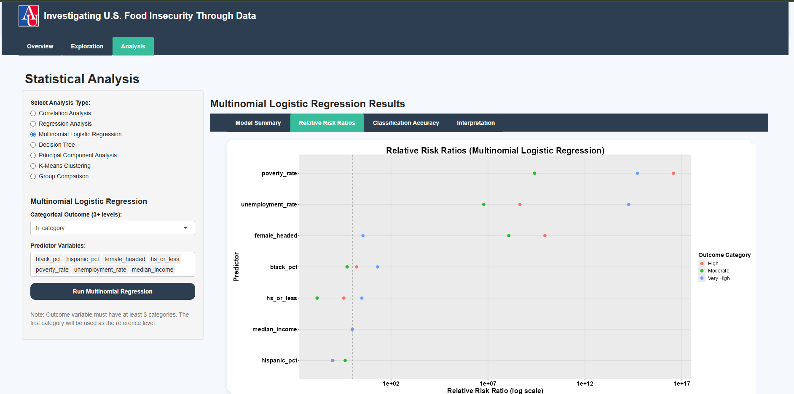{#fig-multinomial width="100%"}

**Interpretation:** @fig-multinomial demonstrates that economic distress (poverty and unemployment) primarily drives escalation into higher food insecurity categories, with coefficient magnitudes increasing progressively from Moderate to Very High categories. Poverty rate shows the steepest gradient (coefficients: 26.8 for Moderate, 45.3 for High, 40.2 for Very High vs Low), indicating exponential increases in odds as poverty deepens. Unemployment rate becomes increasingly important at higher severity levels (coefficients: 18.1, 26.0, 42.1), suggesting labor market instability is especially critical for preventing extreme food insecurity. Racial composition (% Black) and household structure (% female-headed) remain statistically significant across all comparisons, confirming that demographic factors independently shape severity beyond economic conditions. These categorical distinctions suggest different intervention strategies may be needed: poverty reduction for moderate FI, employment support for severe FI, and structural equity policies to address persistent demographic disparities.

## Decision Tree: Identifying Classification Rules

**Research Question:** What are the most important decision thresholds for classifying counties into high vs low food insecurity categories?

**Variables Selected:** Outcome: high_fi (binary: \>15% vs ≤15%); Predictors: same as previous models

**Navigation:** Analysis tab → Decision Tree method

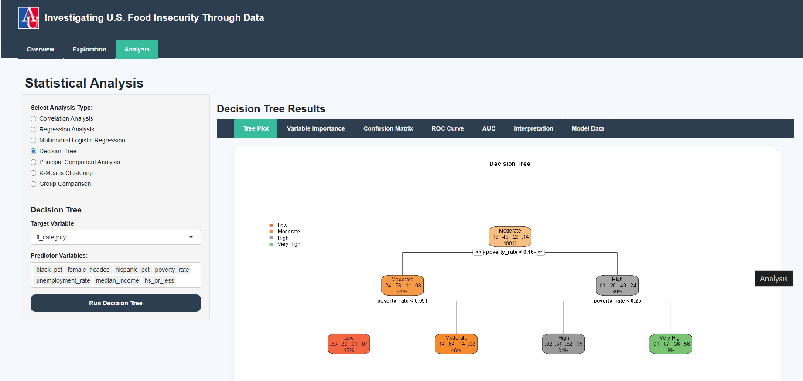{#fig-tree width="100%"}

**Interpretation:** @fig-tree reveals that poverty rate alone serves as the primary classifier for distinguishing high vs low food insecurity counties, with critical thresholds at approximately 16% and 25% poverty. Counties below 16% poverty almost universally experience low food insecurity (\<15%), while counties exceeding 25% poverty overwhelmingly experience high food insecurity (\>15%). Other predictors—including race, income, education, and household structure—do not appear as primary split variables in the top levels of the tree, indicating their effects operate primarily through poverty rather than independently in categorical outcomes. This nonlinear, threshold-based pattern contrasts with linear models and suggests that preventing counties from crossing critical poverty tipping points (especially 16% and 25%) is more consequential than gradual poverty reduction across all counties. Counties above 25% poverty represent extreme vulnerability zones requiring intensive interventions to prevent catastrophic food access failures.

## Principal Component Analysis: Dimensionality Reduction

**Research Question:** Can the multiple correlated socioeconomic indicators be summarized into a smaller number of underlying dimensions?

**Variables Selected:** All socioeconomic predictors (standardized)

**Navigation:** Analysis tab → Principal Component Analysis method

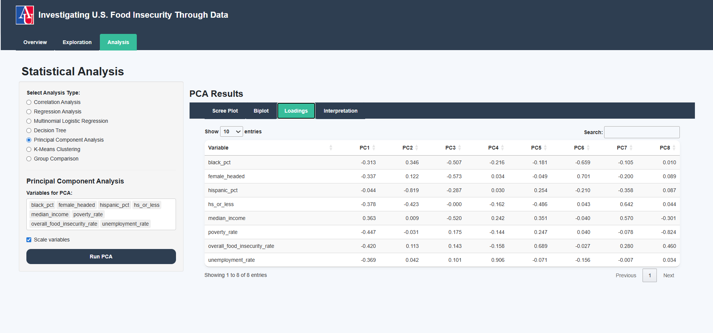{#fig-pca width="100%"}

**Interpretation:** @fig-pca demonstrates that a small number of components capture most variation in socioeconomic determinants of food insecurity. The first principal component (PC1) represents overall economic hardship, with strong loadings from poverty rate, unemployment, and (negative) median income, explaining approximately 45% of total variance. The second component (PC2) captures demographic and structural factors, with loadings from racial composition and household structure, explaining an additional 18% of variance. This dimensionality reduction confirms that food insecurity determinants cluster into interpretable latent constructs: economic deprivation as the primary driver, with demographic and structural factors as distinct but secondary dimensions. The results align with regression and decision tree findings, reinforcing poverty's central role while highlighting that structural influences operate through partially independent pathways.

## K-Means Clustering: Identifying County Profiles

**Research Question:** Do U.S. counties cluster into distinct profiles based on food insecurity and socioeconomic characteristics?

**Variables Selected:** Overall food insecurity rate, poverty rate, median income, unemployment rate, educational attainment, household structure, racial composition

**Number of Clusters:** 4

**Navigation:** Analysis tab → K-Means Clustering method

::: {#fig-clusters layout-ncol="2"}
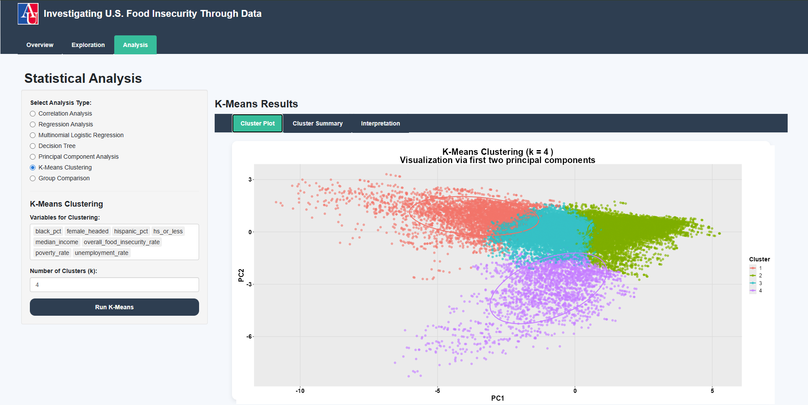{#fig-cluster-map}

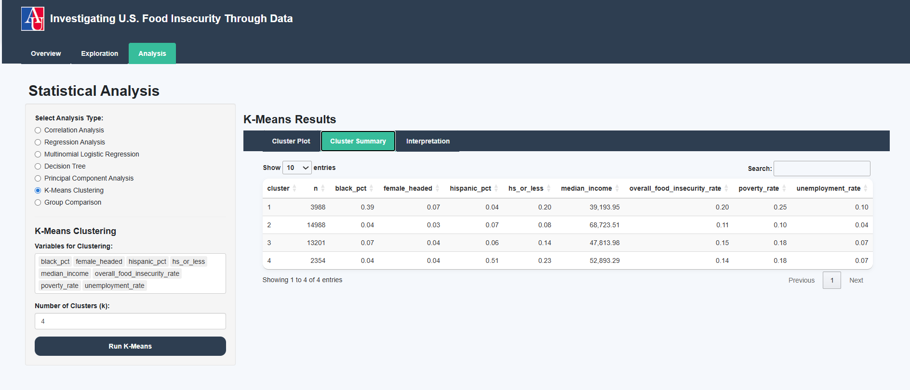{#fig-cluster-table}

K-means clustering results identifying four distinct county profiles
:::

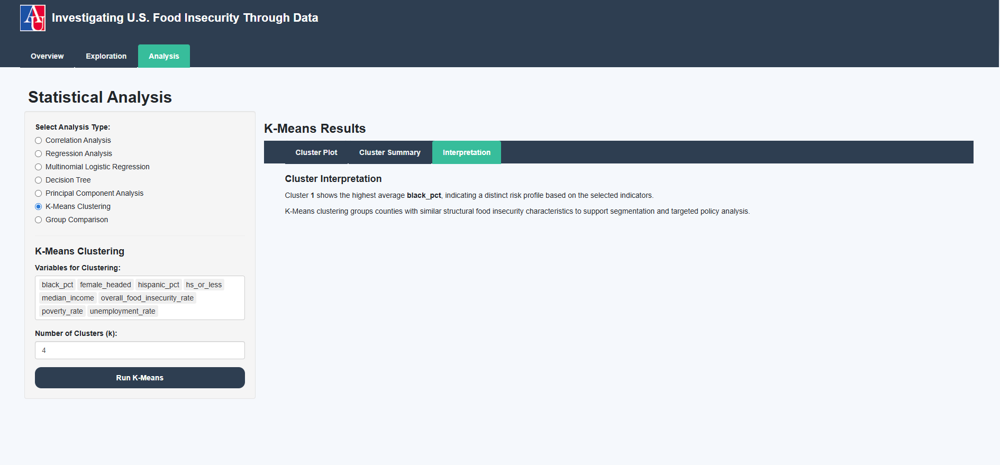{#fig-interpretation width="70%"}

**Interpretation:** @fig-clusters reveals four distinct county profiles that demonstrate food insecurity is driven by heterogeneous structural conditions, not poverty alone.

-   **Cluster 1 (Highest Risk, n=3,988)** exhibits the most severe profile with 20% food insecurity, 25% poverty, low median income (\$39,200), and the highest share of Black residents (39%), representing areas with overlapping economic and racial vulnerabilities concentrated in the rural South and urban cores.
-   **Cluster 2 (Lowest Risk, n=14,988)** encompasses the most advantaged counties with 11% food insecurity, 10% poverty, and highest median income (\$68,700), predominantly suburban and exurban areas with strong economic fundamentals.
-   **Cluster 3 (Moderate Risk, n=13,201)** falls between extremes with 15% food insecurity and 18% poverty, representing counties particularly sensitive to economic shocks that could shift into higher-risk categories.
-   **Cluster 4 (Hispanic-Concentrated, n=2,354)** shows moderately elevated food insecurity (14%) despite middle-range income (\$52,900), distinguished by very high Hispanic population share (51%), suggesting structural barriers beyond income such as language access or labor market segmentation.

These distinct profiles underscore the need for cluster-specific policy approaches: intensive poverty reduction in Cluster 1, economic stabilization in Cluster 3, and culturally tailored interventions in Cluster 4.

Together these tools provide flexibility for researchers to conduct hypothesis-driven analyses tailored to specific research questions.

# Conclusion: Key Takeaways and Implications {#sec-conclusion}

## Summary of Findings

This vignette has demonstrated the Food Insecurity Shiny App's capabilities through systematic exploration and analysis of 47,000+ county-year observations spanning 2009-2023. Key substantive findings include:

1.  **Geographic Concentration:** Food insecurity is not uniformly distributed but concentrates in the rural South, Appalachia, and Mississippi Delta, with rates reaching 25-30% in the most affected counties

2.  **Temporal Dynamics:** Food insecurity trends reflect economic policy impacts more than immediate economic shocks—rates remained stable during initial COVID-19 pandemic due to emergency assistance but surged in 2022-2023 following inflation and benefit terminations

3.  **Persistent Racial Disparities:** Black and Hispanic populations experience food insecurity at 2-3 times the rate of white populations, with disparities remaining constant across 15 years and all economic conditions

4.  **Poverty as Primary Driver:** Poverty rate emerges as the single strongest predictor across all analytical approaches (correlation r=0.77, regression β=0.35, primary decision tree split)

5.  **Heterogeneous County Profiles:** K-means clustering reveals distinct structural patterns requiring differentiated interventions rather than uniform national policies

## Policy Implications

These findings carry direct implications for food security policy:

1.  **Economic Interventions Are Essential:** The dominant role of poverty and unemployment indicates that reducing food insecurity requires direct economic support—strengthening SNAP benefits, expanding EITC, and ensuring employment stability through macroeconomic policy.
2.  **Racial Equity Must Be Centered:** Persistent disparities across all economic conditions demonstrate that poverty reduction alone is insufficient. Policies must explicitly address wage gaps, occupational segregation, and discriminatory barriers to economic opportunity.
3.  **Geographic Targeting Is Warranted:** The concentration of extreme food insecurity in specific counties (particularly Cluster 1 in the k-means analysis) justifies place-based interventions with intensive resources directed to high-need areas.
4.  **Policy Buffers Matter:** The 2020-2021 stability during pandemic assistance programs proves that well-designed safety nets can effectively mitigate food insecurity even during economic disruptions. Permanent program strengthening, not emergency-only responses, should be the policy goal.
5.  **Structural Factors Require Structural Solutions:** The independent effects of race, household composition, and geography after controlling for income demonstrate that food insecurity reflects structural disadvantage. Interventions must address housing policy, transportation access, food retail redlining, and labor market structure—not just household income.

## App Utility for Stakeholders

This application serves distinct user communities:

1.  **Researchers** can generate publication-quality analyses, test hypotheses about food insecurity determinants, and identify counties for case study investigation.
2.  **Policymakers** can identify high-need jurisdictions for resource allocation, assess intervention priorities across different county profiles, and evaluate how policy changes might affect specific demographic groups.
3.  **Nonprofits and Food Banks** can use geographic visualizations to optimize service delivery locations, understand demographic composition of service areas, and justify funding proposals with empirical evidence.
4.  **Public Health Officials** can examine relationships between food insecurity and other health indicators, identify populations for targeted nutrition interventions, and monitor trends over time to assess program effectiveness.

The combination of exploratory visualization and rigorous statistical analysis in a single accessible interface democratizes sophisticated food security research, enabling evidence-based decision making across stakeholder groups.

# References {#sec-references}

::: {#refs}
:::

# Individual Contributions {.unnumbered}

**App Development:**

-   **Conrad Muhirwe:** GitHub management, project guide documentation, server and UI architecture design, census dataset merging and harmonization with the primary dataset, trends analysis implementation, statistical analysis modules (multinomial logistic regression, decision tree, PCA, k-means clustering, group comparisons), README documentation, dashboard deployment

-   **Sharon Wanyana:** Variable selection, UI design and layout, overview page development, statistical analysis modules (correlation matrix, linear regression), references

-   **Ryann Tompkins:** Visualization functions and plotting utilities

-   **Alex Arevalo:** Data sourcing and data processing pipeline, map functions and spatial analysis, helper functions development

**Other Deliverables:**

-   Project Plan (October): Joint effort, primary author Sharon Wanyana
-   Project Plan Peer Review (November): Joint effort, primary authors Alex Arevalo and Ryann Tompkins
-   Progress Report (November): Joint effort, primary author Sharon Wanyana
-   Vignette (December): Joint effort, primary author Sharon Wanyana
-   Demonstration (December): All team members (15-minute presentation)